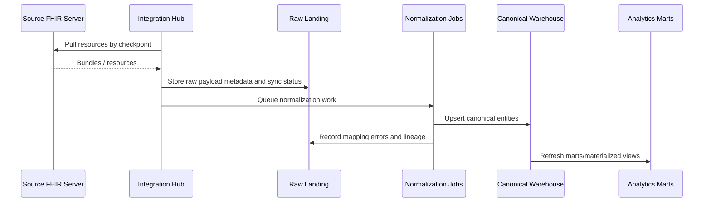
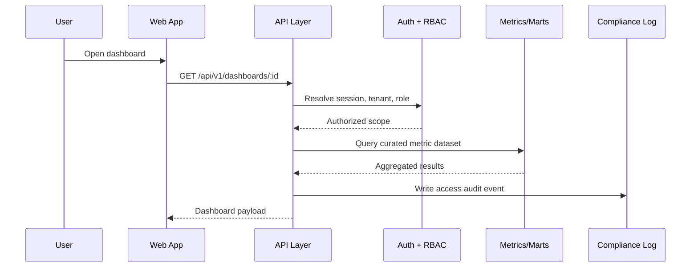
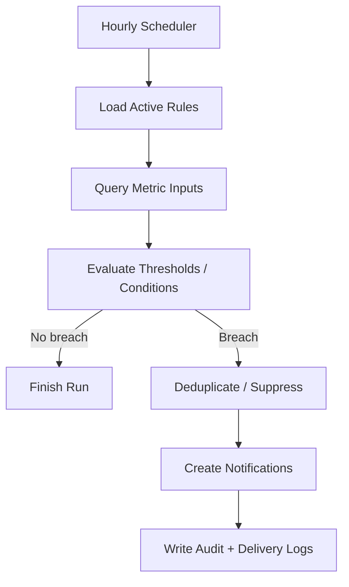
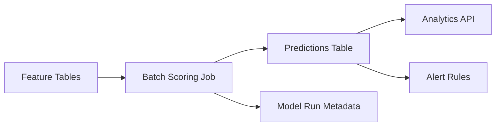

# Data Flow Diagrams

## FHIR Ingestion Flow

```mermaid
sequenceDiagram
    participant S as Source FHIR Server
    participant H as Integration Hub
    participant R as Raw Landing
    participant N as Normalization Jobs
    participant W as Canonical Warehouse
    participant M as Analytics Marts

    H->>S: Pull resources by checkpoint
    S-->>H: Bundles / resources
    H->>R: Store raw payload metadata and sync status
    H->>N: Queue normalization work
    N->>W: Upsert canonical entities
    N->>R: Record mapping errors and lineage
    W->>M: Refresh marts/materialized views
```

## Dashboard Query Flow

```mermaid
sequenceDiagram
    participant U as User
    participant W as Web App
    participant A as API Layer
    participant O as Auth + RBAC
    participant M as Metrics/Marts
    participant C as Compliance Log

    U->>W: Open dashboard
    W->>A: GET /api/v1/dashboards/:id
    A->>O: Resolve session, tenant, role
    O-->>A: Authorized scope
    A->>M: Query curated metric dataset
    M-->>A: Aggregated results
    A->>C: Write access audit event
    A-->>W: Dashboard payload
```

## Alert Evaluation Flow

```mermaid
flowchart TD
    Scheduler[Hourly Scheduler] --> Rules[Load Active Rules]
    Rules --> Metrics[Query Metric Inputs]
    Metrics --> Eval[Evaluate Thresholds / Conditions]
    Eval -->|No breach| Done[Finish Run]
    Eval -->|Breach| Dedup[Deduplicate / Suppress]
    Dedup --> Notify[Create Notifications]
    Notify --> Audit[Write Audit + Delivery Logs]
```

## Model Scoring Flow

```mermaid
flowchart LR
    FEATURES[Feature Tables] --> SCORE[Batch Scoring Job]
    SCORE --> PRED[Predictions Table]
    PRED --> API[Analytics API]
    PRED --> ALERTS[Alert Rules]
    SCORE --> MODEL_AUDIT[Model Run Metadata]
```

