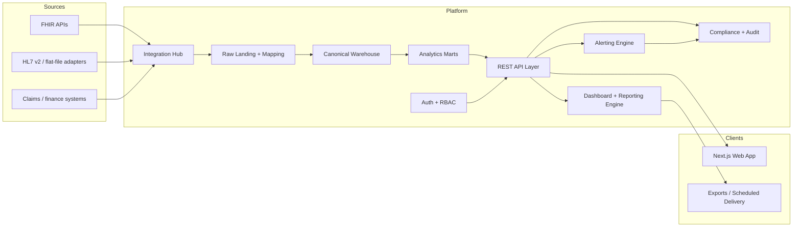

# Recommended Architecture

## High-Level View

## Service Boundaries

### Web Application

- Tenant-aware UI built with Next.js 14
- Consumes REST APIs for dashboards, reports, admin flows, and integration operations
- Avoids direct database access outside controlled server-side boundaries

### API Layer

- Exposes `/api/v1`
- Resolves auth context, tenant scope, RBAC, and request validation
- Orchestrates reads from warehouse marts and writes to administrative/configuration tables

### Integration Hub

- Registers source systems and credentials
- Runs extraction jobs and normalization pipelines
- Maintains source health, sync checkpoints, and mapping errors

### Data Warehouse

- Stores canonical clinical, financial, and configuration entities
- Publishes curated marts and materialized aggregates
- Separates raw source payloads from curated analytics tables

### Dashboard and Reporting Engine

- Manages dashboard definitions, widget metadata, report templates, and export jobs
- Reads only curated metrics or approved drill-down datasets

### Alerting Engine

- Evaluates metric thresholds and cohort conditions on a schedule
- Creates in-app, email, or webhook notifications

### Compliance and Audit

- Records authentication events, PHI access, exports, and privileged config changes
- Supports tenant-level review and forensic investigation

## Runtime Deployment

- Host `apps/web` and lightweight API routes on Vercel
- Use Supabase for Postgres, auth, storage, and optional edge features
- Use scheduled jobs for ingestion, transforms, reports, and alerts; move to dedicated workers if throughput requires

