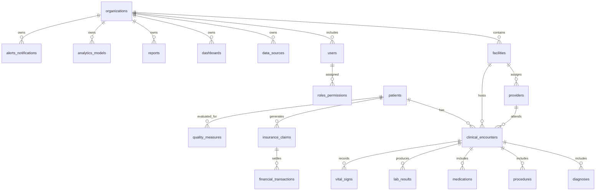

# Data Model Design

## Design Principles

- Canonical relational model stored in Supabase Postgres
- UUID primary keys
- `tenant_id` on all tenant-owned tables
- Source lineage preserved through `source_system`, `source_record_id`, and sync metadata where relevant
- Curated analytics tables separated from raw ingestion payloads

## Core ER Diagram

## Table Schemas

### organizations

| Column | Type | Notes |
| --- | --- | --- |
| id | uuid pk | organization identifier |
| tenant_id | uuid | tenant scope, unique per organization group |
| name | text | display name |
| type | text | hospital, health-system, clinic-group |
| status | text | active, suspended, onboarding |
| created_at | timestamptz | audit field |
| updated_at | timestamptz | audit field |

**Indexes**

- `(tenant_id)`
- `(tenant_id, status)`

### facilities

| Column | Type | Notes |
| --- | --- | --- |
| id | uuid pk | facility identifier |
| tenant_id | uuid | tenant scope |
| organization_id | uuid fk | parent organization |
| name | text | facility name |
| facility_type | text | hospital, clinic, lab, network |
| external_id | text | source reference |
| timezone | text | reporting context |
| created_at | timestamptz | audit field |
| updated_at | timestamptz | audit field |

**Indexes**

- `(tenant_id, organization_id)`
- `(tenant_id, external_id)`

### patients

| Column | Type | Notes |
| --- | --- | --- |
| id | uuid pk | internal patient key |
| tenant_id | uuid | tenant scope |
| organization_id | uuid fk | owning org |
| medical_record_number | text | masked in UI by default |
| external_patient_id | text | source reference |
| first_name | text | PHI |
| last_name | text | PHI |
| date_of_birth | date | PHI |
| sex_at_birth | text | normalized code |
| deceased_flag | boolean | patient status |
| created_at | timestamptz | audit field |
| updated_at | timestamptz | audit field |

**Indexes**

- `(tenant_id, external_patient_id)`
- `(tenant_id, medical_record_number)`
- `(tenant_id, date_of_birth)`

### providers

| Column | Type | Notes |
| --- | --- | --- |
| id | uuid pk | provider key |
| tenant_id | uuid | tenant scope |
| facility_id | uuid fk | primary facility |
| external_provider_id | text | source reference |
| npi | text | national provider identifier |
| first_name | text | display/use |
| last_name | text | display/use |
| specialty | text | normalized specialty |
| created_at | timestamptz | audit field |
| updated_at | timestamptz | audit field |

**Indexes**

- `(tenant_id, npi)`
- `(tenant_id, facility_id, specialty)`

### clinical_encounters

| Column | Type | Notes |
| --- | --- | --- |
| id | uuid pk | encounter key |
| tenant_id | uuid | tenant scope |
| facility_id | uuid fk | encounter facility |
| patient_id | uuid fk | subject patient |
| provider_id | uuid fk | attending provider |
| external_encounter_id | text | source reference |
| encounter_type | text | inpatient, outpatient, ed |
| admit_at | timestamptz | start time |
| discharge_at | timestamptz | end time |
| disposition | text | discharge status |
| status | text | planned, in-progress, finished |
| created_at | timestamptz | audit field |
| updated_at | timestamptz | audit field |

**Indexes**

- `(tenant_id, patient_id, admit_at desc)`
- `(tenant_id, facility_id, admit_at desc)`
- `(tenant_id, external_encounter_id)`

### diagnoses

| Column | Type | Notes |
| --- | --- | --- |
| id | uuid pk | diagnosis key |
| tenant_id | uuid | tenant scope |
| encounter_id | uuid fk | owning encounter |
| patient_id | uuid fk | denormalized for query speed |
| diagnosis_code | text | ICD or equivalent |
| diagnosis_system | text | code system |
| diagnosis_rank | int | primary/secondary order |
| onset_at | timestamptz | if available |
| created_at | timestamptz | audit field |

**Indexes**

- `(tenant_id, diagnosis_code)`
- `(tenant_id, patient_id, diagnosis_code)`

### procedures

| Column | Type | Notes |
| --- | --- | --- |
| id | uuid pk | procedure key |
| tenant_id | uuid | tenant scope |
| encounter_id | uuid fk | owning encounter |
| patient_id | uuid fk | denormalized for query speed |
| procedure_code | text | CPT/HCPCS/etc |
| procedure_system | text | code system |
| performed_at | timestamptz | event time |
| ordering_provider_id | uuid fk nullable | ordering provider |
| created_at | timestamptz | audit field |

**Indexes**

- `(tenant_id, procedure_code)`
- `(tenant_id, performed_at desc)`

### medications

| Column | Type | Notes |
| --- | --- | --- |
| id | uuid pk | medication record key |
| tenant_id | uuid | tenant scope |
| encounter_id | uuid fk nullable | encounter context |
| patient_id | uuid fk | patient |
| medication_code | text | RxNorm or source code |
| medication_name | text | normalized display |
| status | text | active, completed, stopped |
| start_at | timestamptz | start |
| end_at | timestamptz | end |
| created_at | timestamptz | audit field |

**Indexes**

- `(tenant_id, patient_id, status)`
- `(tenant_id, medication_code)`

### lab_results

| Column | Type | Notes |
| --- | --- | --- |
| id | uuid pk | result key |
| tenant_id | uuid | tenant scope |
| encounter_id | uuid fk nullable | encounter context |
| patient_id | uuid fk | patient |
| loinc_code | text | standardized lab code |
| result_value | numeric | numeric result where applicable |
| result_text | text | textual result |
| unit | text | unit |
| collected_at | timestamptz | collection time |
| abnormal_flag | text | high, low, critical, normal |
| created_at | timestamptz | audit field |

**Indexes**

- `(tenant_id, patient_id, collected_at desc)`
- `(tenant_id, loinc_code, collected_at desc)`

### vital_signs

| Column | Type | Notes |
| --- | --- | --- |
| id | uuid pk | vital sign key |
| tenant_id | uuid | tenant scope |
| encounter_id | uuid fk nullable | encounter context |
| patient_id | uuid fk | patient |
| vital_type | text | heart-rate, bp-systolic, bp-diastolic, temp |
| value_numeric | numeric | numeric reading |
| unit | text | unit |
| measured_at | timestamptz | measure time |
| created_at | timestamptz | audit field |

**Indexes**

- `(tenant_id, patient_id, measured_at desc)`
- `(tenant_id, vital_type, measured_at desc)`

### insurance_claims

| Column | Type | Notes |
| --- | --- | --- |
| id | uuid pk | claim key |
| tenant_id | uuid | tenant scope |
| patient_id | uuid fk | patient |
| encounter_id | uuid fk nullable | linked encounter |
| payer_name | text | payer |
| claim_number | text | claim reference |
| claim_status | text | submitted, denied, paid, appealed |
| billed_amount | numeric | amount billed |
| allowed_amount | numeric | amount allowed |
| paid_amount | numeric | amount paid |
| service_start_at | timestamptz | service start |
| service_end_at | timestamptz | service end |
| created_at | timestamptz | audit field |

**Indexes**

- `(tenant_id, claim_number)`
- `(tenant_id, payer_name, claim_status)`
- `(tenant_id, service_start_at desc)`

### quality_measures

| Column | Type | Notes |
| --- | --- | --- |
| id | uuid pk | measure record key |
| tenant_id | uuid | tenant scope |
| patient_id | uuid fk | subject patient |
| facility_id | uuid fk nullable | facility scope |
| measure_code | text | eCQM/HEDIS/etc |
| measure_name | text | display name |
| period_start | date | measurement period |
| period_end | date | measurement period |
| numerator_flag | boolean | numerator |
| denominator_flag | boolean | denominator |
| gap_flag | boolean | unresolved care gap |
| created_at | timestamptz | audit field |

**Indexes**

- `(tenant_id, measure_code, period_end desc)`
- `(tenant_id, patient_id, measure_code)`

### financial_transactions

| Column | Type | Notes |
| --- | --- | --- |
| id | uuid pk | transaction key |
| tenant_id | uuid | tenant scope |
| claim_id | uuid fk nullable | related claim |
| facility_id | uuid fk nullable | facility scope |
| transaction_type | text | charge, payment, adjustment, writeoff |
| amount | numeric | amount |
| posted_at | timestamptz | posting time |
| payer_name | text | payer |
| status | text | posted, reversed, pending |
| created_at | timestamptz | audit field |

**Indexes**

- `(tenant_id, posted_at desc)`
- `(tenant_id, transaction_type, status)`

### dashboards

| Column | Type | Notes |
| --- | --- | --- |
| id | uuid pk | dashboard key |
| tenant_id | uuid | tenant scope |
| organization_id | uuid fk | org scope |
| name | text | dashboard name |
| category | text | clinical, financial, population-health |
| definition_json | jsonb | widget layout and query bindings |
| visibility | text | private, role-based, org-wide |
| created_by | uuid fk | creator |
| created_at | timestamptz | audit field |
| updated_at | timestamptz | audit field |

**Indexes**

- `(tenant_id, category)`
- `(tenant_id, visibility)`

### reports

| Column | Type | Notes |
| --- | --- | --- |
| id | uuid pk | report key |
| tenant_id | uuid | tenant scope |
| organization_id | uuid fk | org scope |
| dashboard_id | uuid fk nullable | source dashboard |
| name | text | report name |
| format | text | csv, xlsx, pdf |
| schedule_cron | text nullable | optional schedule |
| status | text | draft, active, archived |
| created_by | uuid fk | owner |
| created_at | timestamptz | audit field |
| updated_at | timestamptz | audit field |

**Indexes**

- `(tenant_id, status)`
- `(tenant_id, organization_id)`

### users

| Column | Type | Notes |
| --- | --- | --- |
| id | uuid pk | internal user id |
| auth_user_id | uuid | Supabase auth subject |
| tenant_id | uuid | active tenant context for membership row or default org |
| email | text | unique user email |
| full_name | text | display name |
| status | text | invited, active, suspended |
| last_login_at | timestamptz | security insight |
| created_at | timestamptz | audit field |
| updated_at | timestamptz | audit field |

**Indexes**

- `(auth_user_id)`
- `(tenant_id, email)`

### roles_permissions

| Column | Type | Notes |
| --- | --- | --- |
| id | uuid pk | assignment key |
| tenant_id | uuid | tenant scope |
| user_id | uuid fk | assigned user |
| role_name | text | admin, analyst, executive, compliance, integration |
| permission_set | jsonb | resolved grants |
| organization_id | uuid fk nullable | optional org scope |
| facility_id | uuid fk nullable | optional facility scope |
| created_at | timestamptz | audit field |

**Indexes**

- `(tenant_id, user_id)`
- `(tenant_id, role_name)`

### data_sources

| Column | Type | Notes |
| --- | --- | --- |
| id | uuid pk | source key |
| tenant_id | uuid | tenant scope |
| organization_id | uuid fk | owning org |
| source_type | text | fhir, hl7, claims, file |
| name | text | display name |
| base_url | text | connection target |
| auth_type | text | oauth2, basic, api-key, sftp |
| sync_frequency | text | hourly, daily, manual |
| last_sync_at | timestamptz | ops insight |
| status | text | active, error, paused |
| created_at | timestamptz | audit field |
| updated_at | timestamptz | audit field |

**Indexes**

- `(tenant_id, source_type, status)`
- `(tenant_id, organization_id)`

### analytics_models

| Column | Type | Notes |
| --- | --- | --- |
| id | uuid pk | model key |
| tenant_id | uuid | tenant scope |
| organization_id | uuid fk | org scope |
| model_name | text | display name |
| model_type | text | risk-score, forecast, anomaly |
| version | text | semantic version |
| status | text | draft, validated, active, retired |
| feature_dataset_ref | text | source reference |
| metrics_json | jsonb | evaluation metadata |
| created_at | timestamptz | audit field |
| updated_at | timestamptz | audit field |

**Indexes**

- `(tenant_id, model_name, version)`
- `(tenant_id, status)`

### alerts_notifications

| Column | Type | Notes |
| --- | --- | --- |
| id | uuid pk | alert or delivery key |
| tenant_id | uuid | tenant scope |
| organization_id | uuid fk | org scope |
| alert_type | text | threshold, quality-gap, model-score |
| subject_type | text | dashboard, report, patient-cohort, model |
| subject_id | uuid nullable | linked object |
| severity | text | info, warning, critical |
| channel | text | in-app, email, webhook |
| status | text | active, triggered, delivered, failed, muted |
| payload_json | jsonb | rule or delivery payload |
| triggered_at | timestamptz | event time |
| created_at | timestamptz | audit field |

**Indexes**

- `(tenant_id, status, severity)`
- `(tenant_id, organization_id, triggered_at desc)`

## Multi-Tenant Notes

- Every tenant-owned table includes `tenant_id`.
- Shared lookup data such as standardized code sets may live in global tables without tenant ownership.
- RLS policies should constrain reads and writes based on authenticated tenant membership and scoped role assignments.

